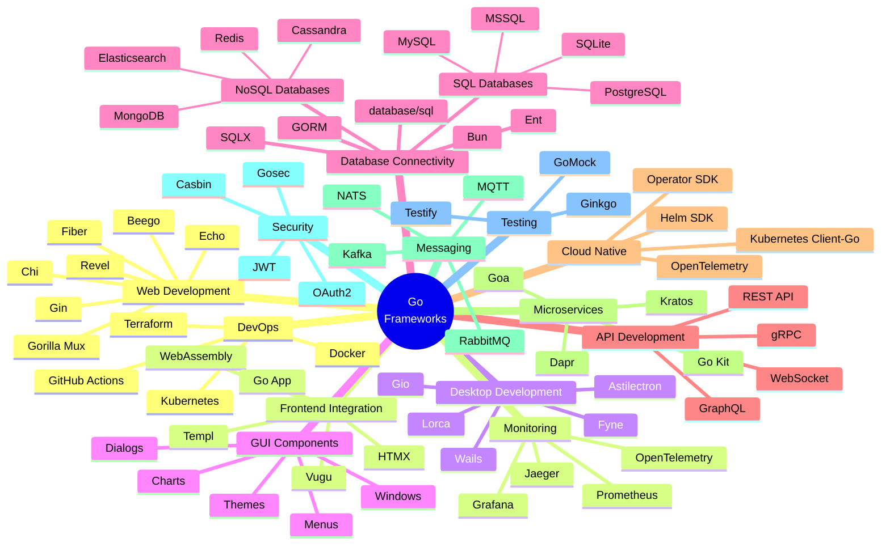
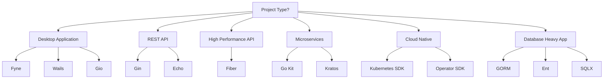

    

        
    

# [Go](https://github.com/cybersecurity-dev/awesome-go-programming-resources) Development Toolkit

    
    &nbsp;
    
    &nbsp;
    
    

## 📖 Contents
- [My Awesome Lists](#my-awesome-lists)
- [Contributing](#contributing)
- [Contributors](#contributors)

##

### My Awesome Lists
You can access the my other awesome lists [here](https://cyberthreatdefence.com/my_awesome_lists)

### Contributing
[Contributions of any kind welcome, just follow the guidelines](contributing.md)!

### Contributors
[Thanks goes to these contributors](https://github.com/cybersecurity-dev/Golang-Toolkit/graphs/contributors)!

[🔼 Back to top](#go-development-toolkit)
